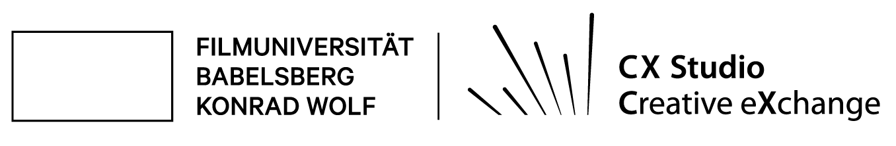
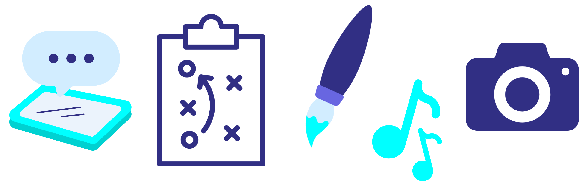
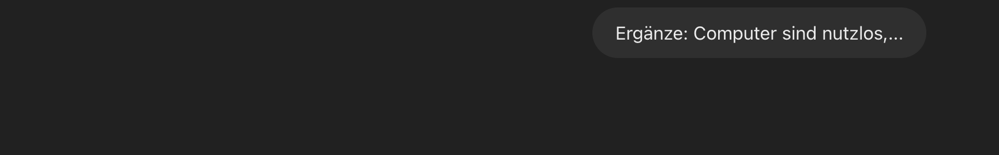
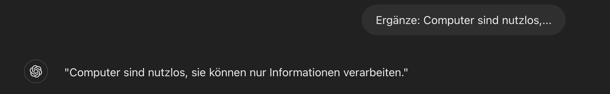
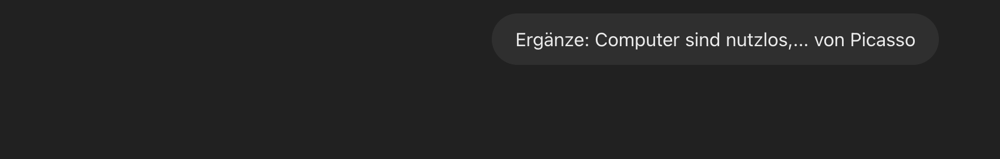
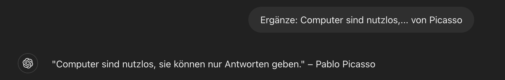
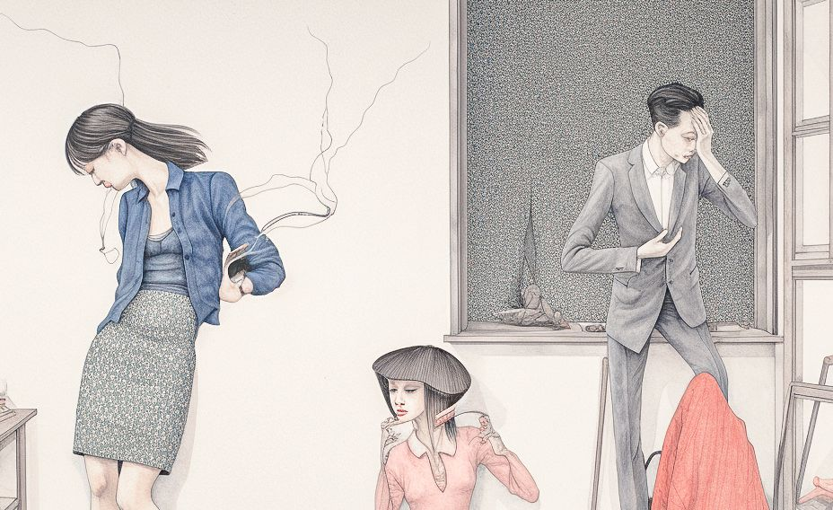
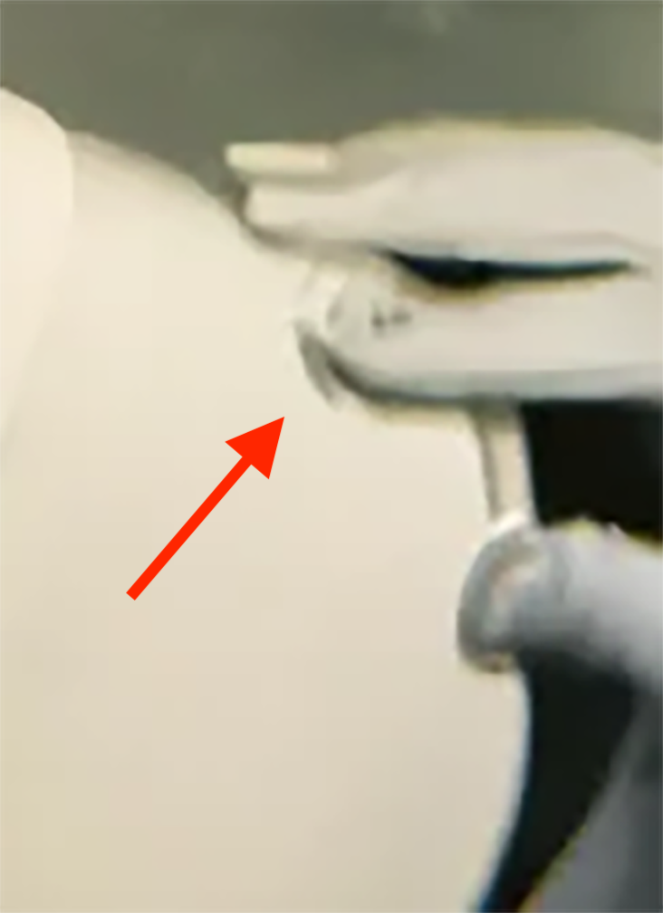
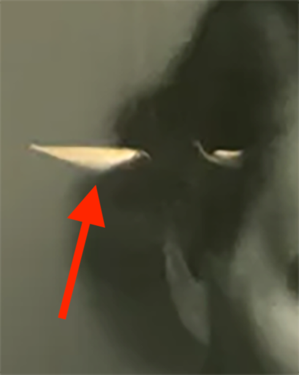

name: inverse
layout: true
class: center, middle, inverse
---

.center[]

  
# *KI – Über was sprechen wir eigentlich?*

#### Prof. Dr. Lena Gieseke

### 07.06.2024 | media.think.tank 2024

???
.task[COMMENT:]  

Vielen Dank für die Vorstellung und guten Morgen auch von mir.

In meinem Beitrag heute möchte ich ihnen ein intuitives und grundlegendes Verständnis über das, von dem wir heute sprechen, nämlich KI, jenseits des Hypes vermittel.

Dazu starte ich mit einer Aufgabe, die Sie erst mal nur mit zu machen brauchen - im Laufe meiner Präsentation, gibt es die Auswertung.

Und zwar möchte ich, dass Sie sich merken oder auch lernen, dass wenn ich...

---

# Apa Khabar?

???
.task[COMMENT:]  

... apa kabar frage, Sie mit...

--

# Baik!

???
.task[COMMENT:]  

...baik antworten. Wenn Sie die Worte nicht verstehen, gut. Das ist Teil der Aufgabe. Wenn sie sie verstehen, bitte behalten sie es für sich.

Genauso, wenn ich...

---

# Satu Dua?

???
.task[COMMENT:]  

... satu dua frage, Sie mit...

--

# Tiga!

???
.task[COMMENT:]  

...tiga antworten. Das über wir noch mal kurz....

Merken Sie sich die Antworten, wir kommen darauf zurück. Und mit dieser Aufgabe, stecken wir auch schon tief in der Agenda für heute. Ich gehe im folgenden...

---
layout:false

## Agenda

* Was ist Künstliche Intelligenz?

???
.task[COMMENT:]  

...auf den Begriff KI ein, ....

--
* Wie funktioniert maschinelles Lernen?

???
.task[COMMENT:]  

...auf die zu grundlegende Funktionsweise von maschinellem Lernen,...

--
* KI und Kunst?

???
.task[COMMENT:]  

..., und auf die Beziehung von KI zu künstlerisch-kreativen Ausdruck mit audiovisuellen Medien.

Also,...

---
template:inverse

# Künstliche Intelligenz?

???
.task[COMMENT:]  

...was ist aktuell KI...

---
layout: false

## Künstliche Intelligenz

.center[]

.footnote[[L. Gieseke, ChatGPT 4o]]

???
.task[COMMENT:]  

...und stehen Roboter und Algorithmen kurz davor die besseren Menschen zu werden? Die Antwort ist nein.

Die tatsächlich aktuell verfügbaren Möglichkeiten fallen in den Bereich der schwachen KI, ...

---

## Schwache KI

???
.task[COMMENT:]  

...was bedeutet, dass typisch menschliche Kernfähigkeiten...

--

* Wahrnehmen
* Kommunizieren
* Planen
* Schlussfolgern
* Lernen

???
.task[COMMENT:]  

...wie z.B. wahrnehmen, kommunizieren und lernen, gut oder sogar sehr viel besser von Computern als von Menschen erledigt werden. Aber das gilt auch nur für ganz bestimmte Aufgaben,...

---
## Schwache KI

 

.center[]

.footnote[[L. Gieseke, Canva]]

???
.task[COMMENT:]  

...wie z.B. Texte schreiben oder audiovisuelle Inhalte generieren mit separaten Systemen.

Und wie eine Maschine lernen kann, möchte ich ihnen anhand von...

---

## ChatGPT

???
.task[COMMENT:]  

...ChatGPT ganz grundsätzlich erklären. Falls ihnen ChatGPT wie ein Hype vorkommt, kann ich ihnen sagen, der Hype ist war, ChatGpT ist nämlich...

--------

ChatGPT ist ein Produkt der Firma OpenAI, eine Forschungseinrichtung...
... mit offiziell non-profit & for-profit Aktivitäten, wobei meiner Einschätzung nach der non-profit Bereich nicht wirkliche Relevanz haben wird. Zum Stichwort Relevanz, 

* Unternehmensbewertung $86 Milliarden
* Z.B. Microsoft hat über $10 Milliarden investiert

* [Wiki](https://www.wikiwand.com/en/ChatGPT): ChatGPT is built on OpenAI's proprietary series of generative pre-trained transformer (GPT) models and is fine-tuned for conversational applications using a combination of supervised learning and reinforcement learning from human feedback.

--
* Die sich am schnellsten verbreitende Verbraucher-Software der Geschichte

???
.task[COMMENT:]  

...die sich am schnellsten verbreitende Verbraucher-Software der Geschichte.

------

---
.header[ChatGPT]

## Funktionsweise

--

Ergänze:

> Computer sind nutzlos,...
  

???
.task[COMMENT:]  

* Suche den Satz in einem Buch und nehme was danach kommt.

--
  
Antworten:

* ...wenn sie keinen Strom haben.

--
* ...sie können einem nur Antworten geben.

--
* ...wenn sie kaputt sind.

---
.header[ChatGPT]

## Funktionsweise

Ergänze:

> Computer sind nutzlos,...
  
Antworten:

* ...wenn sie keinen Strom haben. → 80 Punkte
* ...sie können einem nur Antworten geben. → 50 Punkte
* ...wenn sie kaputt sind. → 10 Punkte

---
.header[ChatGPT]

## Funktionsweise

> Katalogisierung der Wahrscheinlichkeit von bestimmten Buchstabenreihenfolgen.

???
.task[COMMENT:]  

--------

* Die statistische Substruktur von Sprache
* Reinforcement learning, damit sich ChatGPT natürlich verhält

--

* Apa Kabar? Baik!
* Satu Dua? Tiga!

???
.task[COMMENT:]  

* Kopieren, manipulieren, zusammenfügen

--

> ChatGPT hat kein Verständnis von dem, worüber es schreibt!

  
???
.task[COMMENT:]  

* Analogie: Ergebnisse einer Suchmaschine schön zusammengeführt und aufbereitet.
* Das Ergebnis klingt so, als ob ein Mensch antworten würde

ChatGPT 4o
  
.center[]
  
.center[]
  
.center[]
  
.center[]

---

## Deep Learning

.center[]

.footnote[[L. Gieseke, ChatGPT 4o]]

???
.task[COMMENT:]  

* Mensch: eine Milliarde -> neun Nullen
* ChatGPT: eine Billion -> zwölf Nullen
* Kollektive Intelligenz?

Was ich bis hierhin erläutert haben, kann man im Kern auch auf Bilder und Sound übertragen.   

Und im Kontext von Bildern nun zu der...

---
template:inverse

# KI und Kunst?

???
.task[COMMENT:]  

...Frage nach der Beziehung von KI zu künstlerisch-kreativer Arbeit und künstlerisch-kreativem Ausdruck.

Aktuell fällt es auf, das die Ergebnisse von Bildgenerierungs-Tools oft einem bestimmten Stil folgen, ...

---

## KI Ästhetik

.center[   ]  

.footnote[[L. Gieseke, ChatGPT 4o, Canva]]

???
.task[COMMENT:]  

...wie zum Beispiel ähnlich zu diesen Bildern. Die Frage ist nun ob eine bestimmte Ästhetik in Bildgenerierung-Tools einprogrammiert ist?

Dazu ist zu sagen, dass die Ursache der sich wiederholende Stilisierung nicht bei der Generativen KI liegt, sondern bei den Menschen die sie nutzen. Zum einen erzeugen Nutzer:innen explizit Bilder in bestimmten Stilen, zum anderen wird dieser Stil als "gut bewerten", woran sich wiederum die Generative KI orientiert. Dieser massentaugliche Stil hat also schon vermutlich erstmal eine höhere Wahrscheinlichkeit von System ohne weitere Angaben generiert zu werden, ist aber auf keinen Fall eine inhärente Eigenschaft des System.

Die statistische Dominanz der casual users, also der nicht professionellen Nutzer:innen gegenüber ausgebildeten Künstler:innen schafft die Illusion, dass KI eine einzigartige Ästhetik mit sich bringt. 

Was Sie denken, was von der „Maschine“ kommt, kommt in Wirklichkeit von ihren Nutzer:innen. 

Mit einer entsprechende Ausbildung und Erfahrung ist es zwar nicht trivial,... 

---

## KI Ästhetik

.center[]  

.footnote[[L. Manovich, 2024, [A new note on AI aesthetics](https://www.linkedin.com/posts/levmanovich_a-new-note-on-ai-aesthetics-5252024-activity-7200136041213665280-MVkg?utm_source=share&utm_medium=member_desktop)]]

???
.task[COMMENT:]  

...etwas Interessantes zu schaffen, aber absolut möglich. Der Medientheoretiker Lev Manovich, der dieses Bild mit Midjourney generiert hat, argumentiert in einem Aufsatz, dass es so etwas wie eine KI Ästhetik nicht gibt.

Schauen Sie sich in diesem Kontext auch das folgende Bild an...

---

.center[]  

???
.task[COMMENT:]  

...und reflektieren, inwiefern sie dieses Bild kreativ-künstlerisch gelungen finden.  

Bei dem Bild handelt sich um ein KI generierten Bildes von...

---
.header[Bildgenerierung]

## DALL·E 2
  
.left-quarter[

.footnote[[Allison Parshall. 2023. [*How This AI Image Won a Major Photography Competition*.](https://www.scientificamerican.com/article/how-my-ai-image-won-a-major-photography-competition/) Scientific American.]]
]

.right-quarter[
*The Electrician*, from the series PSEUDOMNESIA, 2022.  
Credit: Boris Eldagsen, co-created with DALLE2  
Courtesy of Photo Edition Berlin

Sony World Photography Awards, 2023: creative photo category winner.
]

???
.task[COMMENT:]  

...dem Fotograph Boris Eldagsen, der mit dem Bild letztes Jahr eigentlich bei den angesehenen Sony World Photography Award einen Preis gewinnen sollte. 
  
      

---
.header[Bildgenerierung]

## DALL·E 2

.left-quarter[

.footnote[[Allison Parshall. 2023. [*How This AI Image Won a Major Photography Competition*.](https://www.scientificamerican.com/article/how-my-ai-image-won-a-major-photography-competition/) Scientific American.]]
]

.right-quarter[
> Let's call it promptography?
]

???
.task[COMMENT:]  

> 

I used DALL-E 2, and it was all done by text prompts and inpainting and outpainting. For inpainting, you could say, “I don’t like his tie,” and you erase it and write, “I want him to have a white tie.” Then you get suggestions. And if you don’t like any of those suggestions, you start again. Outpainting [is what] you do when the frame is not large enough. You put in an additional frame so you can see his whole tie, his pants, the chair, the floor. It’s endless.

---
.header[Bildgenerierung]

## DALL·E 2

.left-quarter[ 

.footnote[[Allison Parshall. 2023. [*How This AI Image Won a Major Photography Competition*.](https://www.scientificamerican.com/article/how-my-ai-image-won-a-major-photography-competition/) Scientific American.]]
]

.right-quarter[
> Let's call it promptography?
  

> For me, as an artist, AI generators are absolute freedom.
]

???
.task[COMMENT:]  

Und diese beiden Zitate fassen für mich ganz gut zusammen, wo ich denke, dass wir stehen. KI Tools bieten Künstler:innen neue, mächtige Möglichkeiten, die Prozesse, Aufgabenbereiche und letztlich die Branche sicher verändern werden. Aber es braucht nach wie vor die Menschen, die mit Intention und Expertise die Tools steuern, um hochwertige audiovisuelle Medien zu erzeugen.

---
template:inverse

.center[]

#### Prof. Dr. Lena Gieseke | l.gieseke@filmuniversitaet.de

???
.task[COMMENT:]  

Und damit bin ich am Ende und wünsche Ihnen einen schönen Konferenztag.
